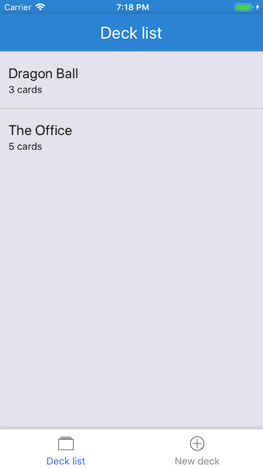
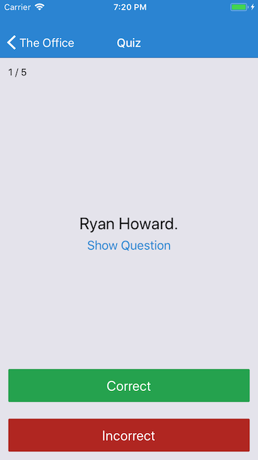
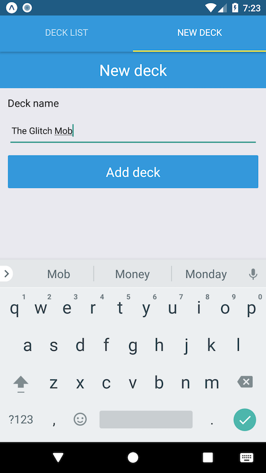
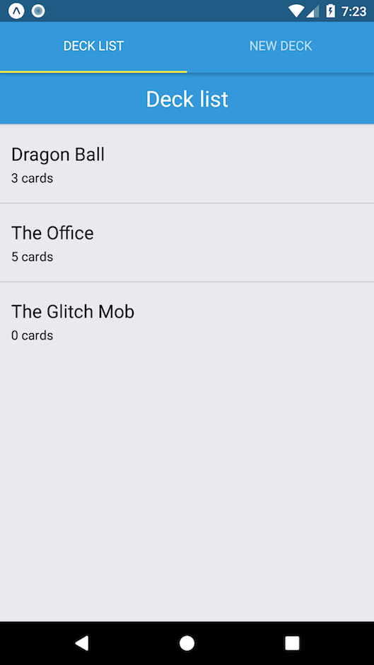
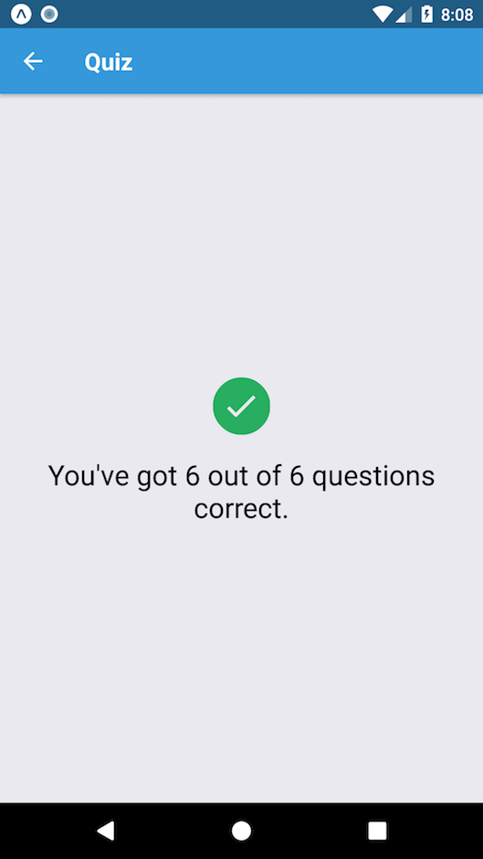

# Flash Cards: A Mobile App Project

This is a project for the Udacity React Nanodegree program.

The project is a mobile app developed with React Native.

To use the project, please start the build process and use an iOS or Android Simulator or a real device:
 * `npm install`
 * `npm start`
     
## Parts of the application

The application allows you to:
* Create an unlimited number of decks
* Add an unlimited amount of flash cards to each deck
* Quiz yourself using any deck
* Get notified if you didn't learn yet that day

## Screenshots

### iOS

### Android

